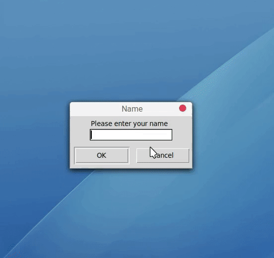

# TCP-Socket-Chat-Room

   A GUI-based TCP-Socket-Chat-Room of Client-Server Architecture where messages are encrypted between Client and Server using AES-256 encryption algorithm and symmetric keys are exchanged using Diffie-Hellman method. 
A server is set to listening mode, with a specific IP Address and Port number (can be edited) and clients are made to connect to the server. The messages are then broadcasted to all the clients present. It handles multiple clients using threading. 
This project is based on Socket Progamming and Network Security and done using Python.

## ► Working
<ul>
  <li>Server is started and set to listening mode.
  <li>Client is started and TCP-socket connection established between Client-Server.
  <li>Server asks for Client's Name.
  <li>Client sends it's Name to Server.
  <li>Server and Client both generate public and private keys and exchange the public keys.
  <li>Both generate similar Shared-Private-Key.(Diffie-Hellman-Method).
  <li>Messages send and received between them are encrypted using that key with AES-256 encryption algorithm.
  <li>Messages sent from client to server are decrypted using that client's private key.
  <li>Then that message is broadcasted to all other clients which is encrypted with their respective keys.
 </ul>

## ► Terminologies
### ◘ Sockets
A network socket is a software structure within a network node of a computer network that serves as an endpoint for sending and receiving data across the network. The structure and properties of a socket are defined by an application programming interface (API) for the networking architecture. Sockets are created only during the lifetime of a process of an application running in the node.

### ◘ TCP
TCP is a connection-oriented and reliable, full duplex protocol supporting a pair of byte streams, one for each direction. A TCP connection must be established before exchanging data. TCP retransmits data that do not reach the final destination due to errors or data corruption. Data is delivered in the sequence of its transmission.

### ◘ Client-Server Architecture
Client-server architecture, architecture of a computer network in which many clients (remote processors) request and receive service from a centralized server (host computer). Client computers provide an interface to allow a computer user to request services of the server and to display the results the server returns. Servers wait for requests to arrive from clients and then respond to them.

### ◘ Diffie-Hellman Key-Exchange Method
Diffie-Hellman key exchange algorithm is a method for securely exchanging cryptographic keys over a public communications channel. Keys are not actually exchanged – they are jointly derived. It is named after their inventors Whitfield Diffie and Martin Hellman. 
If two parties Alice and Bob wish to communicate with each other, they first agree between them a large prime number 'P', and a generator (or base) 'G' (where 0 < G < P). Then, Alice chooses her private key 'A' and then calculates her public key G^A mod P and Bob chooses his private key 'B' and calculates his public key G^B mod P. 
Bob knows 'B' and G^A mod P, so he can calculate (G^A)^B mod P = G^AB mod P. Alice knows 'A' and G^B mod P, so he can calculate (G^B)^A mod P = G^AB mod P. Therefore both Alice and Bob know a Shared Secret Key G^AB mod P. Meanwhile an eavesdropper Eve who was listening in on the communication knows P, G, Alice’s public key (G^A mod P) and Bob’s public key (G^B mod P) won't be able to calculate the shared secret key easily from these values as it is a Discrete Logarithm Problem. 

Prime number 'p' and generator 'g' is chosen for this project from the prime numbers which are specified in RFC3526. Private keys are randomly generated 32-bit numbers. Shared Private Keys are hashed using SHA256 algorithm before using to imporve security.

### ◘ AES Encryption
Advanced Encryption Standard (AES) is one of the most frequently used and most secure symmetric key encryption algorithms available today. It is a symmetrical block cipher algorithm that takes plain text in blocks of 128 bits and converts them to ciphertext using keys of 128, 192, and 256 bits. 
The AES algorithm uses a substitution-permutation, or SP network, with multiple rounds to produce ciphertext. The number of rounds depends on the key size being used. A 128-bit key size dictates ten rounds, a 192-bit key size dictates 12 rounds, and a 258-bit key size has 14 rounds. Each of these rounds requires a round key, but since only one key is inputted into the algorithm, this key needs to be expanded to get keys for each round, including round 0. 
Each round includes:
<ul>
  <li>Byte Substitution
  <li>Shifting the rows
  <li>Mixing the columns
  <li>Adding the round key
</ul>

AES-256 is used for this project where an input key is hashed to a 256 bit key using SHA256 hashing algorithm. Python's 'hashlib' and 'Crypto.Cipher' library/modules is used to implement AES for this project.

## ► Demo
### ◘ Client Interface

### ◘ Working Example with Server

## ► References
<ul>
  <li><a href="https://en.wikipedia.org/wiki/Advanced_Encryption_Standard">https://en.wikipedia.org/wiki/Advanced_Encryption_Standard</a>
  <li><a href="https://en.wikipedia.org/wiki/Diffie%E2%80%93Hellman_key_exchange">https://en.wikipedia.org/wiki/Diffie%E2%80%93Hellman_key_exchange</a>
  <li><a href="https://www.tutorialspoint.com/cryptography/advanced_encryption_standard.htm">https://www.tutorialspoint.com/cryptography/advanced_encryption_standard.htm</a>
  <li><a href="https://stackoverflow.com/questions/12524994/encrypt-decrypt-using-pycrypto-aes-256">https://stackoverflow.com/questions/12524994/encrypt-decrypt-using-pycrypto-aes-256</a>
  <li><a href="https://www.geeksforgeeks.org/implementation-diffie-hellman-algorithm/">https://www.geeksforgeeks.org/implementation-diffie-hellman-algorithm/</a>
  <li><a href="https://doubleoctopus.com/security-wiki/encryption-and-cryptography/diffie-hellman-algorithm/">https://doubleoctopus.com/security-wiki/encryption-and-cryptography/diffie-hellman-algorithm/</a>
  <li><a href="https://www.geeksforgeeks.org/socket-programming-python/">https://www.geeksforgeeks.org/socket-programming-python/</a>
 </ul>
